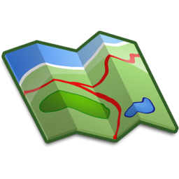

# PyPika GIS

This library contains SpatialTypes functions for extending [PyPika](https://github.com/kayak/pypika) with GIS.

## Table of Contents

- [Install](#install)
- [Examples](#examples)
  - [PostGIS](#postgis)
  - [MSSQL](#mssql)
- [Available functions](#available-functions)
- [Development](#development)
  - [Dependencies](#dependencies)
  - [Setup](#setup)
  - [Tests](#tests)
  - [Publish](#publish)
- [Credits](#credits)

## Install

```bash
pip install pypika-gis
```

## Examples

### PostGIS

```python
from pypika import Query
from pypika_gis.spatialtypes import postgis as st

query = Query.from_('field').select('id', st.AsGeoJSON('geom'))
print(str(query))
# SELECT "id",ST_AsGeoJSON('geom') FROM "field"

query = Query.from_('crop').select('id').where(
    st.Intersects('geom', st.SetSRID(st.MakePoint(10, 5), 4326)))
print(str(query))
# SELECT "id" FROM "crop" WHERE ST_Intersects('geom',ST_SRID(ST_MakePoint(10,5),4326))
```

### MSSQL

```python
from pypika import Query, Table
from pypika_gis.spatialtypes import mssql as st

table = Table('table')
query = Query.from_(table).select(table.id, st.AsText(table.geom))
print(str(query))
# SELECT "id",geom.STAsText() FROM "table"

query = Query.from_(table).select(table.id).where(
    st.Intersects(table.geom, st.GeomFromText('POINT(10 10)', 4326)))
print(str(query))
# SELECT "id" FROM "table" WHERE geom.STIntersects(geometry::STGeomFromText('POINT(10 10)',4326))
```

## Available functions

|      pypika-gis      |          PostGIS          |        MSSQL        |
| :------------------: | :-----------------------: | :-----------------: |
|         Area         |         `ST_Area`         |      `STArea`       |
|       AsBinary       |       `ST_AsBinary`       |    `STAsBinary`     |
|      AsGeoJSON       |      `ST_AsGeoJSON`       |          ❌          |
|        AsMVT         |        `ST_AsMVT`         |          ❌          |
|        AsText        |        `ST_AsText`        |     `STAsText`      |
|       Boundary       |       `ST_Boundary`       |    `STBoundary`     |
|        Buffer        |        `ST_Buffer`        |     `STBuffer`      |
|       Centroid       |       `ST_Centroid`       |    `STCentroid`     |
|     ClosestPoint     |     `ST_ClosestPoint`     |          ❌          |
|       Contains       |       `ST_Contains`       |    `STContains`     |
|      ConvexHull      |      `ST_ConvexHull`      |   `STConvexHull`    |
|      CoveredBy       |      `ST_CoveredBy`       |          ❌          |
|        Covers        |        `ST_Covers`        |          ❌          |
|       Crosses        |       `ST_Crosses`        |     `STCrosses`     |
|        CurveN        |             ❌             |     `STCurveN`      |
|     CurveToLine      |     `ST_CurveToLine`      |   `STCurveToLine`   |
|      Difference      |      `ST_Difference`      |   `STDifference`    |
|      Dimension       |      `ST_Dimension`       |    `STDimension`    |
|       Disjoint       |       `ST_Disjoint`       |    `STDisjoint`     |
|       Distance       |       `ST_Distance`       |    `STDistance`     |
|       DWithin        |       `ST_DWithin`        |          ❌          |
|       EndPoint       |       `ST_EndPoint`       |    `STEndPoint`     |
|       Envelope       |       `ST_Envelope`       |    `STEnvelope`     |
|        Equals        |        `ST_Equals`        |     `STEquals`      |
|     ExteriorRing     |     `ST_ExteriorRing`     |  `STExteriorRing`   |
|        Extent        |        `ST_Extent`        |          ❌          |
|       GeoHash        |       `ST_GeoHash`        |          ❌          |
|      GeometryN       |      `ST_GeometryN`       |    `STGeometryN`    |
|     GeometryType     |     `ST_GeometryType`     |  `STGeometryType`   |
|   GeogFromGeoJSON    |   `ST_GeogFromGeoJSON`    |          ❌          |
|     GeogFromText     |     `ST_GeogFromText`     |  `STGeomFromText`   |
|     GeogFromWKB      |     `ST_GeogFromWKB`      |   `STGeomFromWKB`   |
|      GeogPoint       |      `ST_GeogPoint`       |          ❌          |
| GeogPointFromGeoHash | `ST_GeogPointFromGeoHash` |          ❌          |
|   GeomFromGeoJSON    |   `ST_GeomFromGeoJSON`    |          ❌          |
|    InteriorRingN     |    `ST_InteriorRingN`     |  `STInteriorRingN`  |
|     Intersection     |     `ST_Intersection`     |  `STIntersection`   |
|      Intersects      |      `ST_Intersects`      |   `STIntersects`    |
|     IsCollection     |     `ST_IsCollection`     |          ❌          |
|       IsClosed       |       `ST_IsClosed`       |    `STIsClosed`     |
|       IsEmpty        |       `ST_IsEmpty`        |     `STIsEmpty`     |
|        IsRing        |        `ST_IsRing`        |     `STIsRing`      |
|       IsSimple       |       `ST_IsSimple`       |    `STIsSimple`     |
|       IsValid        |       `ST_IsValid`        |     `STIsValid`     |
|        Length        |        `ST_Length`        |     `STLength`      |
|       MakeLine       |       `ST_MakeLine`       |          ❌          |
|      MakePoint       |      `ST_MakePoint`       |          ❌          |
|     MakePolygon      |     `ST_MakePolygon`      |          ❌          |
|      NumCurves       |             ❌             |    `STNumCurves`    |
|    NumGeometries     |             ❌             |  `STNumGeometries`  |
|   NumInteriorRing    |             ❌             | `STNumInteriorRing` |
|      NumPoints       |             ❌             |    `STNumPoints`    |
|       Overlaps       |       `ST_Overlaps`       |    `STOverlaps`     |
|      Perimeter       |      `ST_Perimeter`       |          ❌          |
|        Point         |        `ST_Point`         |       `Point`       |
|        PointN        |        `ST_PointN`        |     `STPointN`      |
|    PointOnSurface    |    `ST_PointOnSurface`    | `STPointOnSurface`  |
|        Relate        |        `ST_Relate`        |     `STRelate`      |
|       SetSRID        |       `ST_SetSRID`        |          ❌          |
|         SRID         |             ❌             |    `STSrid`[^1]     |
|      StartPoint      |      `ST_StartPoint`      |   `STStartPoint`    |
|    SymDifference     |             ❌             |  `STSymDifference`  |
|       Touches        |       `ST_Touches`        |     `STTouches`     |
|        Union         |        `ST_Union`         |      `STUnion`      |
|        Within        |        `ST_Within`        |     `STWithin`      |
|          X           |          `ST_X`           |      `STX`[^1]      |
|          Y           |          `ST_Y`           |      `STY`[^1]      |
|          Z           |          `ST_Z`           |          ❌          |

[^1]: In MSSQL this is technically a method of the geography/geometry class, and returns a pypika `Field` instead of a `Function`.

## Development

### Dependencies

- [Python](https://www.python.org/downloads/)
- [poetry](https://python-poetry.org/)

### Setup

```bash
poetry install
poetry run pre-commit install
```

### Tests

Full tests and coverage

```bash
poetry run pytest
```

### Publish

```bash
poetry build
poetry publish
```

## Credits

pypika-gis is based on [PyPika](https://github.com/kayak/pypika). Check their page for further query buider instructions, examples and more details about PyPika core.
